# KAIM Weak 10 Challenge

## Brent Oil Price Analysis Project

### Project Overview

This project aims to analyze the impact of significant global events on Brent oil prices over the past few decades, focusing on political decisions, regional conflicts, economic sanctions, and OPEC policy changes. By detecting change points in time series data and analyzing the statistical impact of these events, we provide actionable insights for investors, policymakers, and energy companies. The project involves comprehensive data analysis and model building to predict price fluctuations and understand contributing factors.

As part of **Birhan Energies**, a consultancy dedicated to data-driven insights in the energy sector, this project helps our stakeholders make informed decisions in a volatile market environment.

### Task Breakdown

The project is divided into multiple tasks to facilitate a structured approach to data analysis and model development.

#### Task 1: Define Data Analysis Workflow and Understand the Model
- **Objective:** Plan the analysis workflow and ensure a solid understanding of the data and statistical models.
  - Outline the steps involved in analyzing the data.
  - Familiarize with time series models (e.g., ARIMA, GARCH).
  - Identify model inputs, parameters, and limitations.

#### Task 2: Time Series Analysis and Model Application
- **Objective:** Build on foundational knowledge to analyze Brent oil prices.
  - Utilize statistical and econometric models (e.g., VAR, Markov-Switching ARIMA, LSTM) for complex pattern detection.
  - Analyze economic indicators (GDP, inflation, unemployment) and their relationship to oil prices.
  - Explore political, regulatory, and technological factors that influence oil prices.

#### Task 3: Interactive Dashboard Development
- **Objective:** Create a user-friendly dashboard to visualize analysis results.
  - Develop a Flask-based backend and a React frontend for a seamless experience.
  - Present historical trends, forecasts, and correlations with events through interactive visualizations.

### Folder Structure

The project uses a modular structure to maintain clean, organized code.

```bash

📂 Brent_Oil_Price_Analysis
│  
├── 📁 data
│   ├── exchange_rate
│   │   ├── inflation_unemployment_data.csv
│   │   ├── usd_eur_exchange_rate_fred.csv
│   │   ├── usd_eur_exchange_rates_alpha_vantage.csv
│   ├── evaluation_result.csv
│   ├── events.json
│   ├── major_events.json
│   ├── xgb_metrics.csv
│  
├── 📁 figures
│   ├── ARIMA_forcast_vs_actual.png
│   ├── ARIMA_future_forcast.png
│   ├── CatBoost_actual_vs_predicted.png
│   ├── CatBoost_forcasting_price.png
│   ├── CatBoost_residual.png
│   ├── CatBoost_residual_dist.png
│   ├── DecisionTree_actual_vs_predicted.png
│   ├── DecisionTree_forcasting_price.png
│   ├── DecisionTree_residual.png
│   ├── DecisionTree_residual_dist.png
│   ├── GradientBoosting_actual_vs_predicted.png
│   ├── GradientBoosting_forcasting_price.png
│   ├── GradientBoosting_residual.png
│   ├── GradientBoosting_residual_dist.png
│   ├── RandomForest_actual_vs_predicted.png
│   ├── RandomForest_residual.png
│   ├── RandomForest_residual_dist.png
│   ├── SARIMA_future_forcast.png
│   ├── acf_pcaf_plots.png
│   ├── annotations.png
│   ├── brent_prices_with_events.png
│   ├── dashboard-price.png
│   ├── differenced_price.png
│   ├── merged_prices.png
│   ├── moving_averages.png
│   ├── price_trend.png
│   ├── price_with_exchange_rates.png
│   ├── xgb_actual_vs_predicted.png
│   ├── xgb_historical_future_prediction.png
│   ├── xgb_residual.png
│   ├── xgb_residual_dist.png
│  
├── 📁 frontend
│   ├── 📁 public
│   │   ├── assets
│   │   │   ├── birhan-logo.png
│   │   │   ├── user.png
│   │   ├── favicon.ico
│   │   ├── index.html
│   │   ├── logo192.png
│   │   ├── logo512.png
│   │   ├── manifest.json
│   │   ├── robots.txt
│   ├── 📁 src
│   │   ├── 📁 components
│   │   │   ├── BarChart.jsx
│   │   │   ├── GeographyChart.jsx
│   │   │   ├── Header.jsx
│   │   │   ├── LineChart.jsx
│   │   │   ├── PieChart.jsx
│   │   │   ├── PriceDistribution.jsx
│   │   │   ├── PriceGraph.jsx
│   │   │   ├── PriceRange.jsx
│   │   │   ├── ProgressCircle.jsx
│   │   │   ├── StatBox.jsx
│   │   ├── 📁 data
│   │   │   ├── mockData.js
│   │   │   ├── mockGeoFeatures.js
│   │   │   ├── mockPrice.js
│   │   ├── 📁 scenes
│   │   │   ├── bar/index.jsx
│   │   │   ├── calendar/calendar.jsx
│   │   │   ├── contacts/index.jsx
│   │   │   ├── dashboard/index.jsx
│   │   │   ├── faq/index.jsx
│   │   │   ├── form/index.jsx
│   │   │   ├── geography/index.jsx
│   │   │   ├── global/Sidebar.jsx
│   │   │   ├── global/Topbar.jsx
│   │   │   ├── invoices/index.jsx
│   │   │   ├── line/index.jsx
│   │   │   ├── pie/index.jsx
│   │   │   ├── prices/index.jsx
│   │   │   ├── team/index.jsx
│   │   ├── App.js
│   │   ├── index.css
│   │   ├── index.js
│   │   ├── theme.js
│   ├── .gitignore
│   ├── README.md
│   ├── package-lock.json
│   ├── package.json
│  
├── 📁 notebooks
│   ├── kaim-week-10-eda.ipynb
│   ├── kaim-week-10-predict.ipynb
│   ├── kaim-week-10-relation.ipynb
│   ├── kaim-week-10-task-1.ipynb
│   ├── kaim-week10-task-1.ipynb
│   ├── kaim_week_10_SARIMA_LSTM.ipynb
│   ├── task-2.ipynb
│  
├── 📁 scripts
│   ├── 📁 catboost_info
│   │   ├── learn
│   │   │   ├── events.out.tfevents
│   │   ├── catboost_training.json
│   │   ├── learn_error.tsv
│   │   ├── time_left.tsv
│  
├── 📁 src
│   ├── __init__.py
│   ├── analysis.py
│   ├── arima_model.py
│   ├── data_loader.py
│   ├── feature_engineering.py
│   ├── model_training.py
│  
├── .gitignore
├── app.py
├── main.py
                         

```

### Installation

To set up the project on your local machine, follow these steps:

1. **Clone the Repository**:
   ```bash
   git clone https://github.com/tedoaba/KAIM-W10.git
   cd KAIM-w10
   ```

2. **Install Dependencies**:
   Use the following command to install necessary packages:
   ```bash
   
   python -m venv .week10

   source .week10/Scripts/activate

   pip install -r requirements.txt

   ```

4. **Set Up Dashboard (Flask + React)**:
   - Navigate to the `scripts` directory and start the Flask server:
     ```bash
     python app.py
     ```
   - Navigate to the `frontend` directory and start the React app:
     ```bash
     npm install
     npm start
     ```

5. **Access the Dashboard**:
   Open your browser and go to `http://localhost:3000` to interact with the dashboard.

### Visualization

The interactive dashboard provides the following visualization features:

- **Historical Trends**: Line charts displaying historical Brent oil price trends with highlighted events.

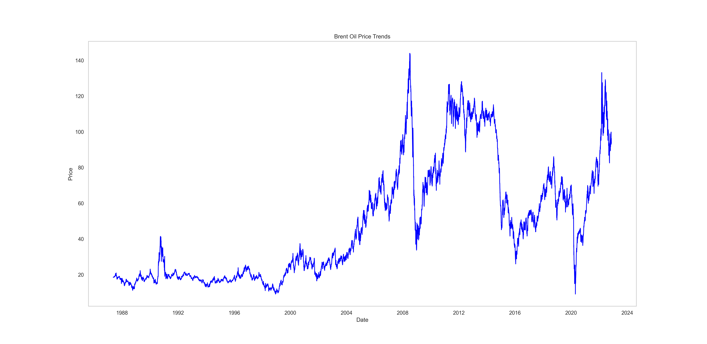

- **Correlation Analysis**: Scatter plots showing relationships between Brent oil prices and selected economic indicators (natural gas price, exchange rate, etc.).

#### Oil Price with Natural Gas

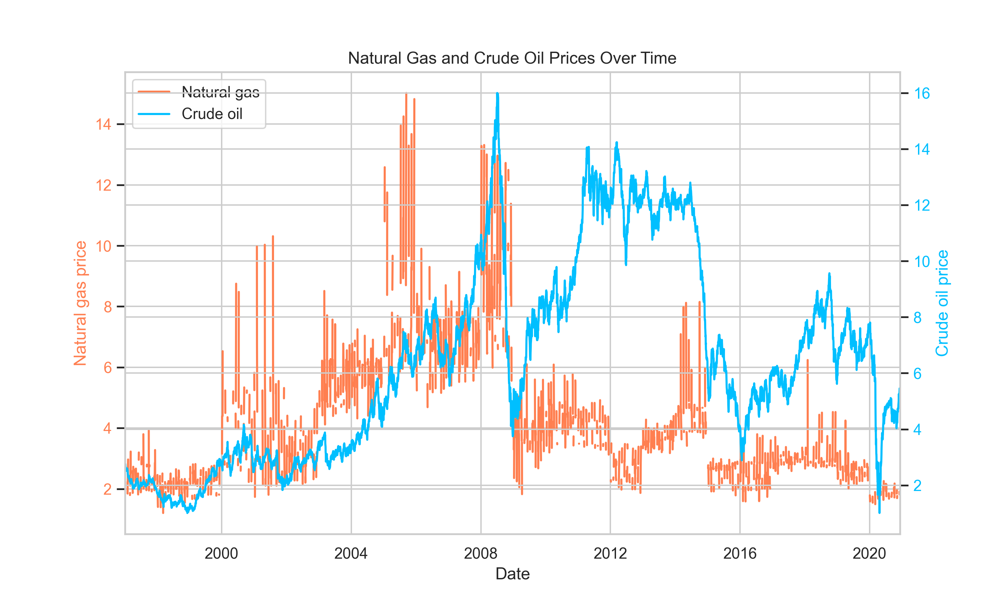

#### Moving Average

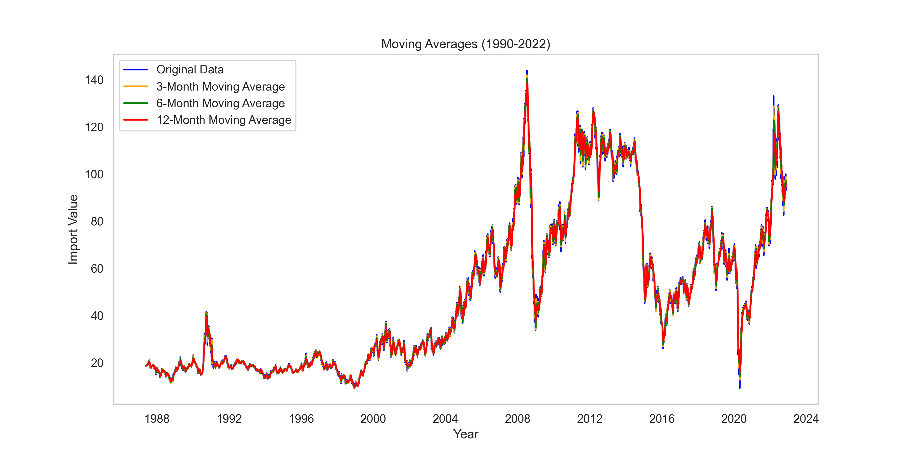

#### Oil Price with Exchange Rate

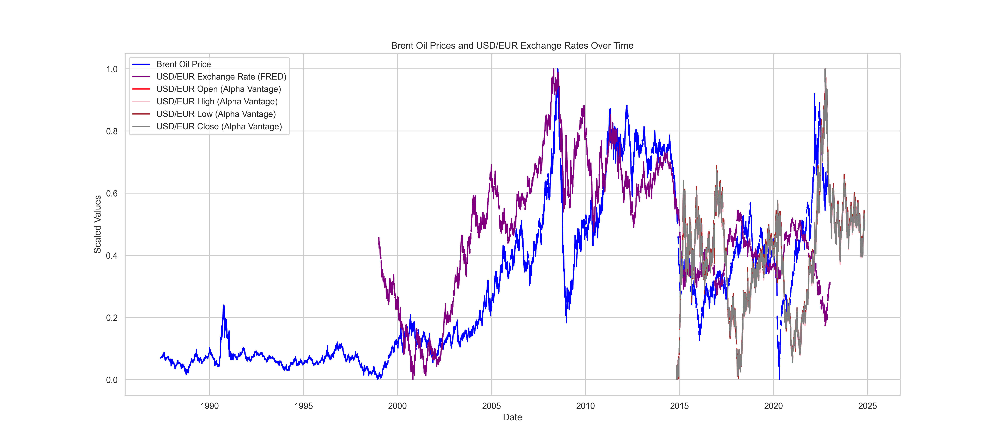

- **Event Highlights**: Interactive elements that allow users to select and highlight specific events on the timeline.

#### Natural gas vs Oil Price


#### US Economic Depresson

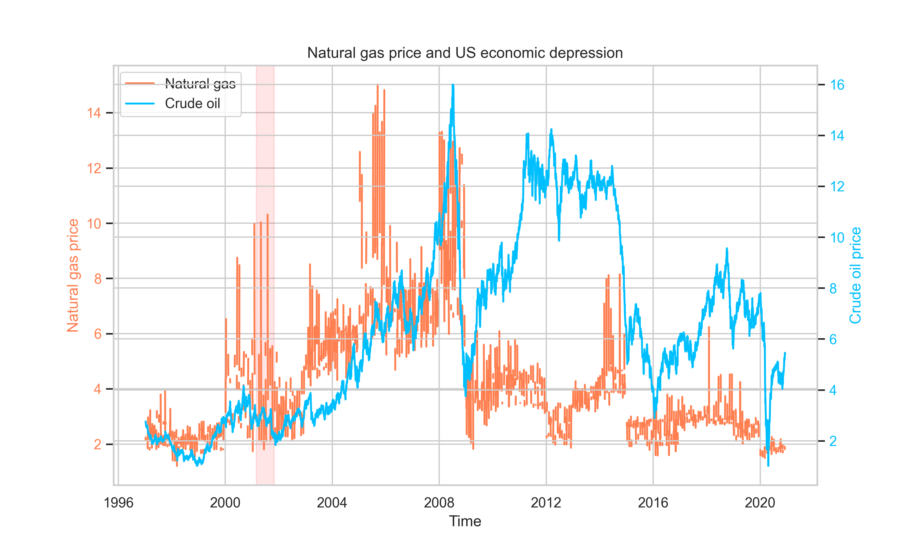

- **Model Future Forcast Results**: Interactive elements that allow users to select and highlight future prices on the timeline.

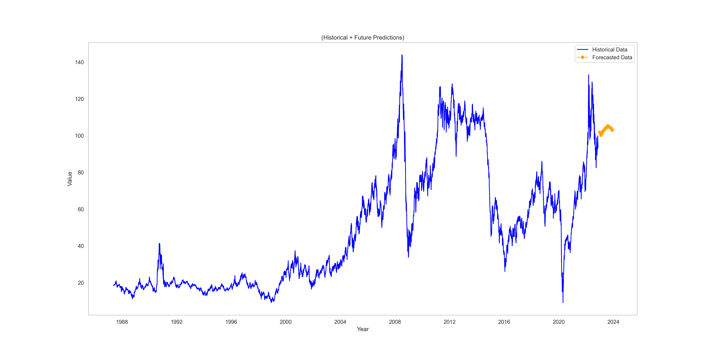

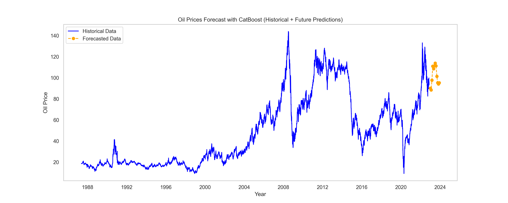


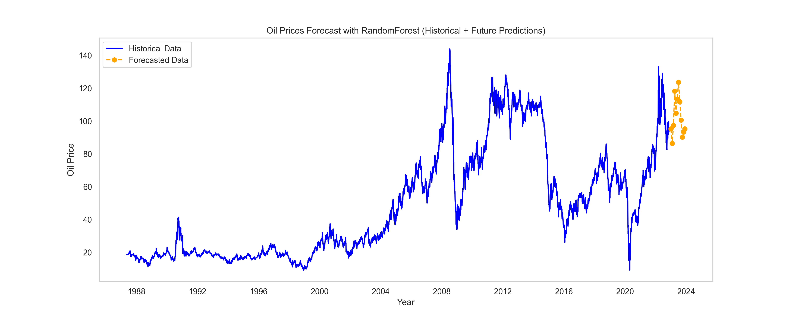

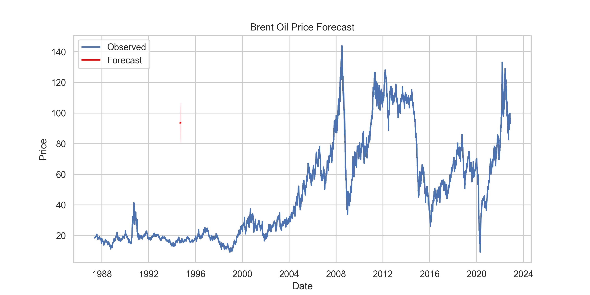

- **Residual Distribution**: Interactive elements that allow users to select and highlight residual distribution on the timeline.

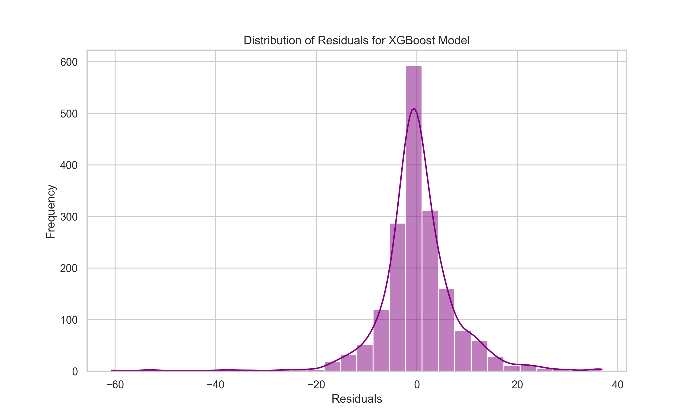

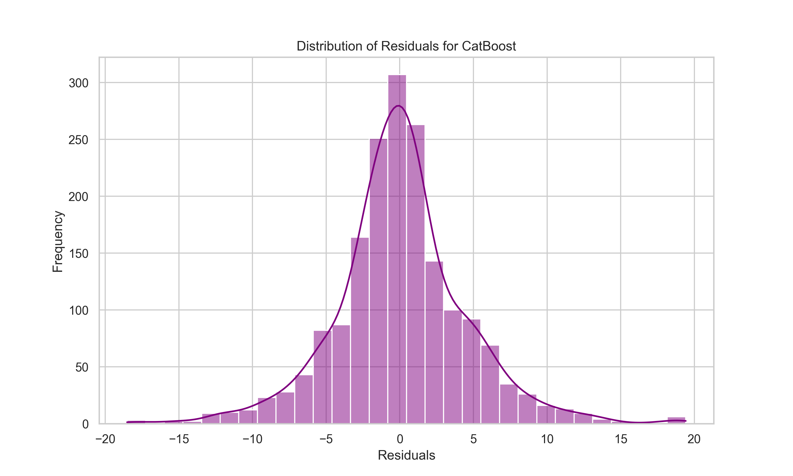


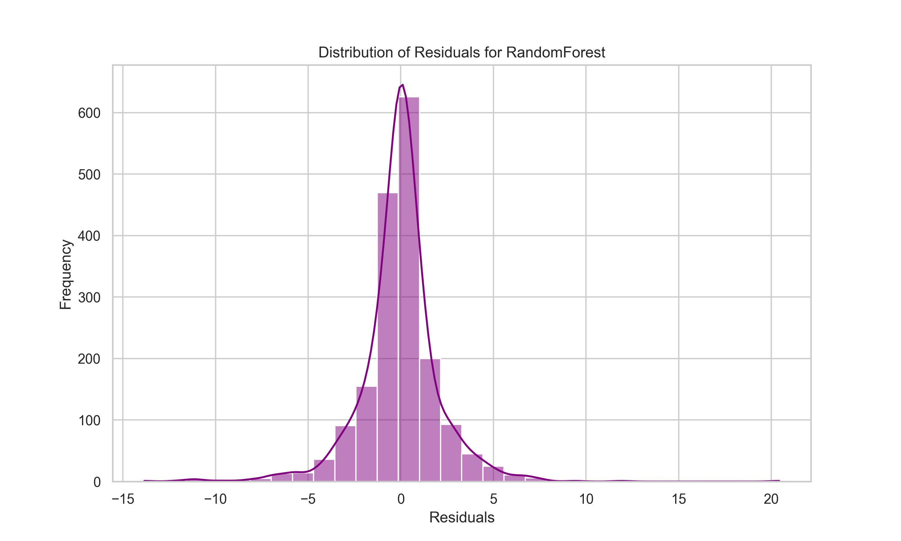


- **Forecasting and Predictions**: Displayed through charts (e.g., Recharts, Chart.js) for understanding future price movements based on selected models.


### Contributing

We welcome contributions! To contribute:

1. **Fork the Repository**: Create a fork and clone it locally.
2. **Create a Branch**:
   ```bash
   git checkout -b feature-name
   ```
3. **Make Your Changes**: Implement your feature or fix.
4. **Run Tests**: Ensure all tests pass before committing.
5. **Push and Submit PR**:
   ```bash
   git push origin feature-name
   ```
6. **Submit a Pull Request**: Describe your changes and submit the pull request for review.

For significant changes, please open an issue first to discuss your ideas.
